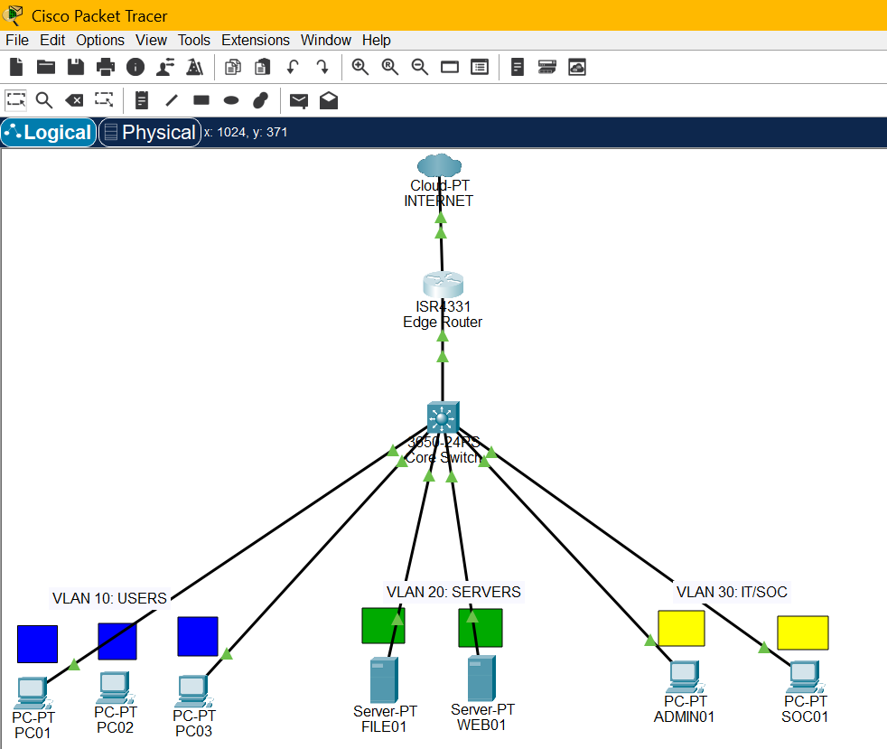

# Lateral Movement & Ransomware Vector Detection (SOC Portfolio)

## 📌 Executive Summary
This project demonstrates end-to-end detection, analysis, and containment of simulated internal lateral movement targeting **Server Message Block (SMB / TCP 445)** within an enterprise environment (*Apex Manufacturing Ltd.*). 

Using an isolated dual-VM virtual network, network telemetry was captured, analyzed with Wireshark/TShark, and processed through a custom Python detection script mapped to **MITRE ATT&CK** techniques.

---

## 🏗️ Architecture & Lab Setup

- **Workstation / Source Host (`SOC01`):** `192.168.56.10` (Kali Linux)
- **Target File Server (`FILE01`):** `192.168.56.20` (Kali Linux)
- **Subnet:** `192.168.56.0/24` (VirtualBox Host-Only Isolated Network)

---

## 🔍 Investigation & Traffic Analysis
### 1. Baseline Capture
Normal host-to-host communication was established via ICMP Echo Requests (`baseline.pcap`), showing clean point-to-point traffic with 0% packet loss and baseline ARP resolution.

### 2. Attack Simulation & Anomaly
A suspicious surge of TCP port 445 connection attempts was directed from the workstation to the target server:
- **Rate:** 20 connection requests generated in **< 0.1 seconds**.
- **Wireshark Analysis:** Captured 44 frames showing rapid `SYN` floods and TCP resets (`RST, ACK`).

---

## 🛡️ Automated Detection Engine
A custom Python script (`python/smb_detector.py`) analyzes connection logs for lateral movement indicators:
- **Volume Threshold:** Flags >= 10 connection attempts from a single source.
- **Fan-out Detection:** Identifies multi-host sweeps across distinct internal IPs.
- **Critical Asset Tagging:** Raises alerts to **CRITICAL** when high-value systems (`FILE01`) are targeted.
- **MITRE ATT&CK Mapping:**
  - `T1021.002` - SMB/Windows Admin Shares
  - `T1046` - Network Service Discovery

---

## 🔒 Containment & Defensive Remediation
1. **Network Layer:** Implement router ACLs and VLAN segmentation to isolate user workstations from admin services.
2. **Endpoint Control:** Enforce host firewall policies disabling incoming SMB on client subnets.
3. **Identity & Access:** Disable SMBv1, enforce SMB signing, and restrict Domain Admin logins on general workstations.
